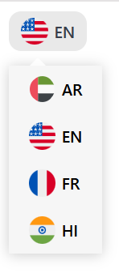
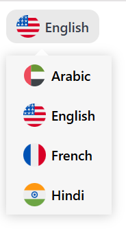

# Google Web Translator

A simple, lightweight, and customizable translator component for your web application.

## 📸 Screenshots

| Screenshot 1 | Screenshot 2 | Screenshot 3 |
|--------------|--------------|--------------|
|  |  |  |

## 🚀 Getting Started

### ✅ Step 1: Download Required Files

Download the following:

- `oranbyte-google-translator.css`
- `oranbyte-google-translator.js`
- `/flags/` folder (contains SVG icons for each language)


### ✅ Step 2: Project Structure

Place the files in your project like this:

```
/css
    oranbyte-google-translator.css
/js
    oranbyte-google-translator.js
    /flags
        en.svg
        hi.svg
        ar.svg
        es.svg
        ...etc
```

> **Note:** Keep the `/flags` folder in the same directory as the `oranbyte-google-translator.js` file.


### ✅ Step 3: Include Files in Your HTML

```html
<!DOCTYPE html>
<html lang="en">
<head>
  <meta charset="UTF-8">
  <meta name="viewport" content="width=device-width, initial-scale=1.0">
  <title>My Website</title>
  <link rel="stylesheet" href="/css/oranbyte-google-translator.css">
</head>
<body>

  <script src="/js/oranbyte-google-translator.js"></script>
</body>
</html>
```

### ✅ Step 4: Add the Translator Component

Place the following where you want the language selector:

```html
<div id="oranbyte-google-translator"></div>
```


## ⚙️ Customization Options

### 🌐 Set Default Language

Use the `data-default-lang` attribute to define the default language:

```html
<div id="oranbyte-google-translator" data-default-lang="hi"></div>
```


### 🌐 Define Custom Language List

Use the `data-languages` attribute to restrict language options:

```html
<div id="oranbyte-google-translator" data-languages="en,hi,ar,fr,es,it"></div>
```

> ⚠️ **Note:** Only a few flag icons are provided for performance reasons.  
> If a language flag is missing, download it from [Iconify Flag Icons](https://icon-sets.iconify.design/circle-flags/) and add it to the `/flags` folder using the language code as the file name (e.g., `fr.svg`).

### 🎨 Customize UI Styles

You can apply styles to control how the language selector looks.

```html
<div id="oranbyte-google-translator"
     data-lang-root-style="text-flag"
     data-lang-list-style="text-flag">
</div>
```

#### Available Styles

| Style       | Description                        |
|-------------|------------------------------------|
| `code-flag` | Default: Flag + Language Code      |
| `text-flag` | Flag + Language Name               |
| `flag`      | Flag Only                          |
| `code`      | Language Code Only                 |
| `text`      | Language Name Only                 |


### 🔧 Combined Usage Example

```html
<div id="oranbyte-google-translator"
     data-default-lang="hi"
     data-languages="en,hi,ar,fr"
     data-lang-root-style="flag"
     data-lang-list-style="flag">
</div>
```

## ❤️ Contributing

Pull requests are welcome!  
For major changes, please open an issue first to discuss what you'd like to change.

## ⭐ Support

If you found this project helpful, please consider giving it a **star**!

<p align="center"><strong>Thanks for using Google Web Translator!</strong></p>
